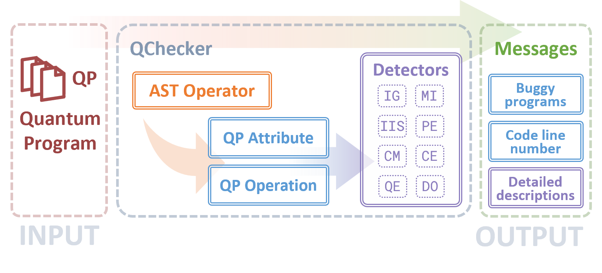

# QChecker: A static buggy quantum program analyzer


## Description
QChecker is a static analysis tool for detecting the potential bugs of quantum programs. It enables effective and efficient potential bug analysis of quantum programs before their execution and deployment. QChecker involves two AST-based program information extraction modules and a comprehensive bug detector with the implementation of multiple bug patterns.
It is capable of detecting varies types of bugs in common python-based quantum programs.
## Structure


## Environment
- QChecker is built on Python 3.10
  ```
  pip install ast
  ```
## Steps to use QChecker
- Clone QChecker
  ```
  git clone
  ```

- Get Start
  ```
  cd Qchecker
  python main.py --file_name [your file name]
  ```


## 2. Rules
Static program check rules are in qchecker.py

| Code | Description |
|--- | --- |
|__IG__| Incorrect uses of quantum gates|
|__MI__ | Measurement related issue  |
|__IIS__ |Incorrect initial state |
|__PE__|Parameters error  |
|__CM__|Command misuse |
|__CE__|Call error |
|__QE__|QASM error |
|__DO__|Discarded orders |

